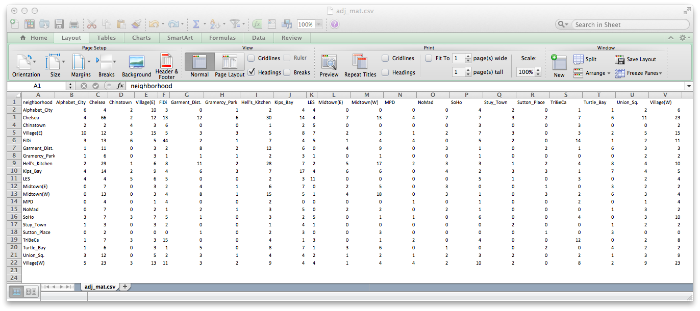
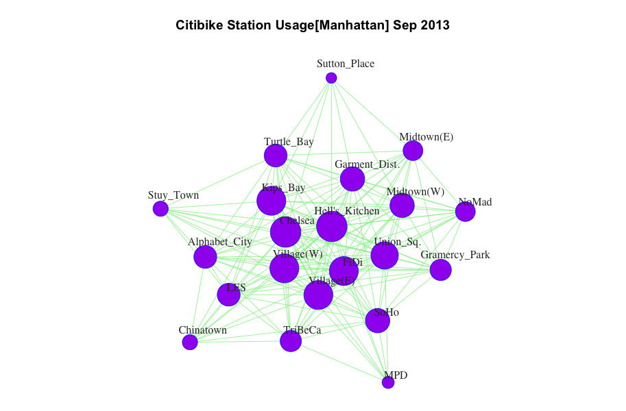
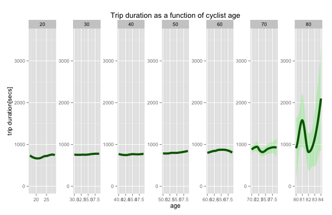
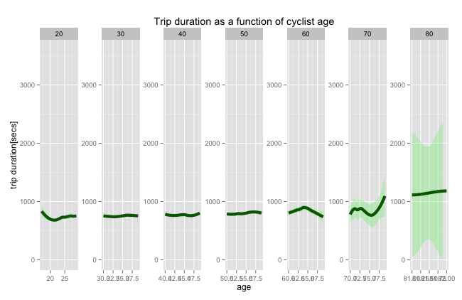
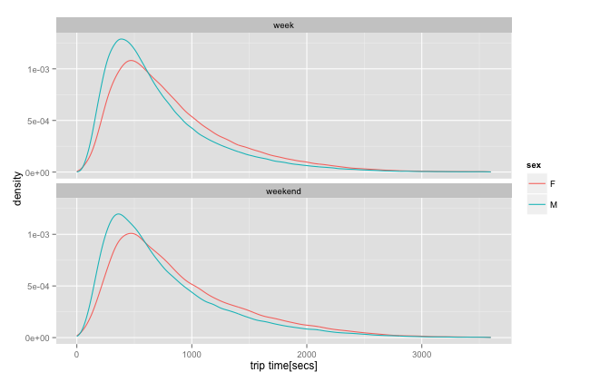
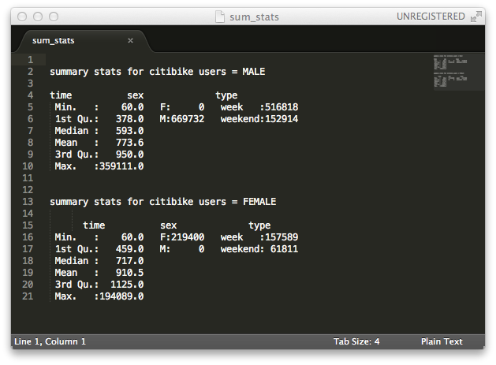
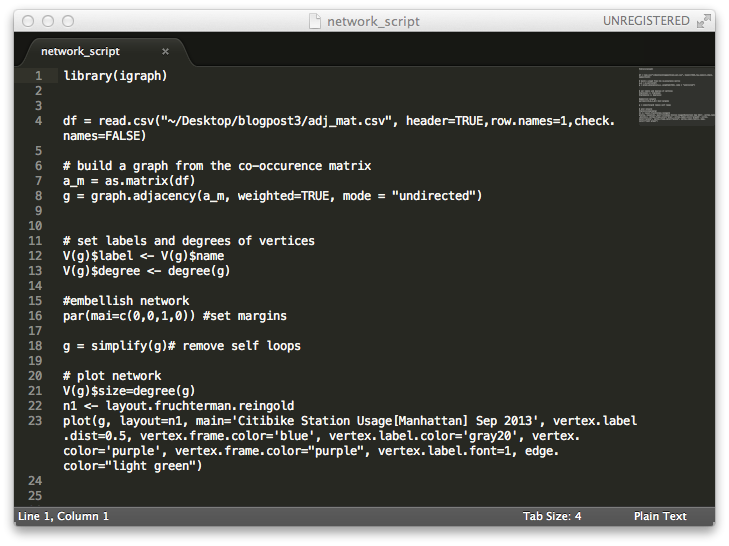

#Sampling 'citibiking' in Manhattan

###Motivation 
It is hoped that citibike will provide an alternative form of transportation in New York a la major European cities such as Paris and Amsterdam. [citibike](http://citibikenyc.com/system-data) released granular data around Q1 2014; and the NYC data science community has expressed sufficient interest to glean this data. Further, I referenced some of the analyses conducted at [NYU's Rudin Center](http://wagner.nyu.edu/rudincenter/category/bikes/citibike/).

###Dataset selection
I chose to analyze the data for Sep 2013 which consisted of approx. 1.04 million rows of data pertaining to stations, trip duration and gender. I elected the month of September since I would imagine that is the most pleasant temperature for riding conditions and the people are back from summer vacations. Sure enough, the month of Sep had the largest file size.

### EDAV considerations
Blogs such as [We're citibiking to work, not play](http://www.wnyc.org/story/were-citibiking-work-not-play/) represent data in tables and excel-like graphs.  Also, a plethora of blogs have lower Manhattan heat maps to display a lot of variables. I wanted to explore citibike station usage as network graph to discover a hub-spoke pattern or a point-to-point pattern.

**Exploratory methodology for sparse matrix genearation(vs eigenvector)**

1. mapped individual stations to Manhattan neighborhoods based on [reference](http://en.wikipedia.org/wiki/List_of_Manhattan_neighborhoods)

2. created a co-occurence matrix of station start and station end with pivot table in Excel

3. entered 0 for station pairs with <= 500 trips

4. normalized the matrix by dividing remaining observations by LCD

*co-occurence matrix*

**Sampling for lowess regression**

My original dataframe consisted of 889,132 observations of 2 variables but R crashed several times when I attempted to compute. I then selected random samples of 50,000 and 100,000 observations; I was forced to sample from a within a sample.

**Data Quality**

I surmise that birth year is a self-reported category since there were birth years starting at 1899. I conducted listwise deletion for data for years from 1899 through 1930. Subsequently, I maintained an age range of  19 - 84 in the dataset.

### Segue to Big Data 
This dataset inlcuded 889,132 rows with 3-5 variables. Encountered several crashes while computing stats and plots in R. Future thinking points: explore solutions to host/compress data. Scary message before computer crash ... 

###Charts

**Graph 1: citibike station network graph**

|specs		|									|
|--------- 	| -----------------------------------
|layout 	| force-directed [fruchterman-reingold]|
|node size	| degree 									|		

As expected, the relatively larger nodes i.e. Kips Bay, Chelsea, Hell's Kitchen, FiDi, East Village, and West Village are in the center; while Sutton Place, Meat Packing District, and Stuy Town are on the edges of the network.

**Graph 2: Cycle trip duration by sex, by age decade**

**Insights**
1. Samping is hard since; the charts below with 100,000 and 50,000 samples respectively, give different results

2. Initially, I used linear regression and observed a line with a flat slope.

3. I wanted to explore the granularity by age group to discern patters if any. To that end, I used loess method for local polynomial regression.

**Graph 3: Cycle trip duration distribution by sex, by weekday type**

**Insights**

1. Similar shape of distributions during the week and weekend

2. Interesting that median time for male vs female trip 593secs(~10min) vs 717secs(~12min)

3. Male/female ratio week: ~ 3.3 and weekend: ~2.5

4. Max time male vs female ~100mins vs ~54mins if the data quality is accurate.

### R script for network graph

